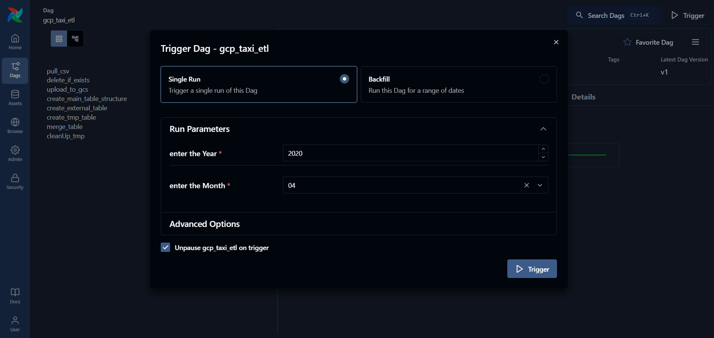
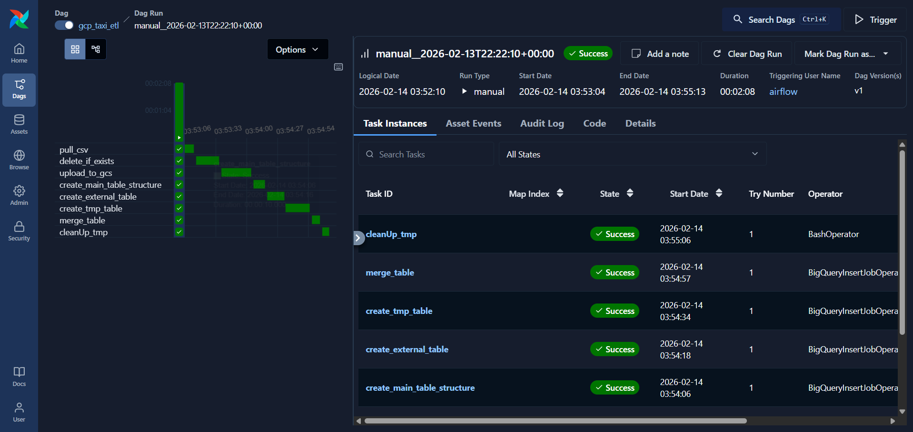
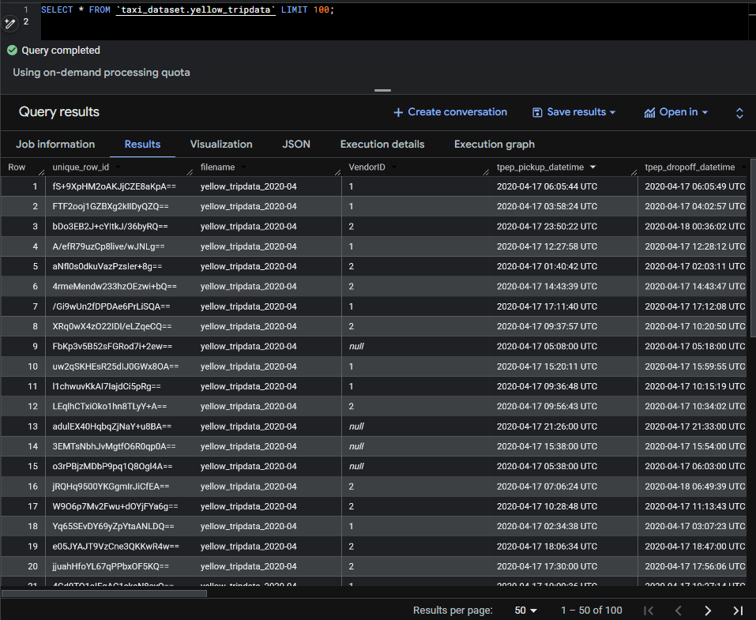
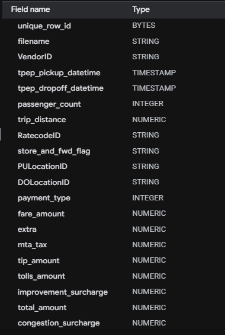

# GCP Yellow Taxi Data Pipeline

An Apache Airflow-based ETL pipeline that orchestrates the ingestion and transformation of NYC Yellow Taxi trip data from GitHub into Google Cloud Storage (GCS) and Google BigQuery for analytics and data warehousing.

## Overview

This project implements a scalable data pipeline using Apache Airflow and Docker that:
- Downloads NYC Yellow Taxi historical data from the DataTalks Club repository
- Uploads raw CSV files to Google Cloud Storage
- Creates and manages BigQuery tables for data warehousing
- Performs data transformation and merging operations
- All processes are containerized and easily deployable

## Features

- **Automated ETL Pipeline**: Fully orchestrated workflows using Apache Airflow
- **GCP Integration**: Seamless integration with Google Cloud Storage and BigQuery
- **Docker Support**: Complete containerization for easy deployment
- **Parameterized DAGs**: Dynamic parameters for year and month selection
- **Data Transformation**: SQL-based transformations using BigQuery
- **Batch Processing**: Efficient batch queries for cost optimization

## Prerequisites

- Docker and Docker Compose
- Google Cloud Platform (GCP) account with:
  - BigQuery API enabled
  - Cloud Storage API enabled
  - Service account with appropriate permissions
- GCP service account credentials JSON file
- For local development (optional): Python 3.11+, pip

## Project Structure

```
.
├── README.md                    # This file
├── Dockerfile                   # Custom Airflow image with dependencies
├── docker-compose.yaml          # Multi-container orchestration
├── requirements.txt             # Python dependencies
├── dags/
│   ├── gcp_yellow_taxi_load.py  # Main ETL pipeline DAG
│   └── sql/
│       ├── table_structure_query.sql    # Main table creation
│       ├── table_external_create.sql    # External table from GCS
│       ├── table_tmp_create.sql         # Temporary table creation
│       └── table_merge.sql              # Merge logic for data loading
├── config/
│   └── airflow.cfg              # Airflow configuration, will be auto-generated on first run
├── logs/                        # DAG execution logs, will be auto-generated
└── plugins/                     # Custom Airflow plugins, will be auto-generated but not needed for this project
```

## Setup Instructions

### 1. Clone the Repository
```bash
git clone <repository-url>
cd gcp-taxi-pipeline
```

### 2. Configure GCP Connection
1. Create a GCP service account with BigQuery and Cloud Storage permissions
2. Download the service account JSON key file
3. Place the credentials in the Airflow container or mount them as volumes
4. In the Airflow UI, create a GCP connection named `conn_gcp` with your credentials

### 3. Configure Environment Variables
Create a `.env` file in the project root:
```bash
AIRFLOW_UID=50000
AIRFLOW_PROJ_DIR=.
_AIRFLOW_WWW_USER_USERNAME=airflow
_AIRFLOW_WWW_USER_PASSWORD=airflow
```

### 4. Build and Start Services
```bash
# Build the custom Docker image
docker-compose build

# Initialize Airflow database
docker-compose up airflow-init

# Start all services
docker-compose up -d
```

### 5. Access Airflow UI
- Navigate to: `http://localhost:8080`
- Default credentials: `airflow` / `airflow`

## How to Run the Pipeline

1. **Via Airflow UI**:
   - Go to the DAGs tab
   - Locate `gcp-yellow-taxi-load` DAG
   - Click "Trigger DAG" and provide parameters:
     - **year**: Year of the data (e.g., 2019)
     - **month**: Month as string (e.g., "01" for January)

2. **Via CLI**:
   ```bash
   docker exec -it <container-id> airflow dags trigger gcp-yellow-taxi-load \
     --exec-date 2025-01-01 \
     --conf '{"year": 2019, "month": "01"}'
   ```

## DAG Workflow

The `gcp_yellow_taxi_load` DAG executes the following tasks in sequence:

1. **pull_csv**: Downloads yellow taxi CSV data from GitHub (gzipped)
2. **delete_if_exists**: Removes existing file from GCS if present
3. **upload_to_gcs**: Uploads CSV to Google Cloud Storage
4. **create_main_table_structure**: Creates the main BigQuery table schema
5. **create_external_table**: Creates an external table pointing to GCS data
6. **create_tmp_table**: Creates a temporary staging table
7. **merge_table**: Merges data from temporary table to main table
8. **cleanUp_tmp**: Removes temporary local CSV file

## Configuration

### Airflow Configuration
- **Executor**: LocalExecutor
- **Database**: PostgreSQL 16
- **Scheduler Health Check**: Enabled
- **Load Examples**: Enabled

### GCP Configuration
Update the user-defined macros in `dags/gcp_yellow_taxi_load.py`:
```python
"bucket" : "dt_yellow_trip_data",           # Your GCS bucket name
"GCP_PROJECT_ID" : "dtc-course-486xxx",    # Your GCP project ID
"BQ_DATASET" : "taxi_dataset"               # Your BigQuery dataset
```

### DAG Scheduling
By default, the DAG is set to manual triggering (`schedule=None`). To enable automated monthly execution, update the `schedule` parameter in `dags/gcp_yellow_taxi_load.py`:

**For monthly execution on the first day of each month at midnight UTC:**
```python
schedule='0 0 1 * *'  # Cron expression: month start
```

Other common schedule examples:
```python
schedule='@monthly'                    # Monthly schedule (1st of month at 00:00)
schedule='0 0 * * 0'                   # Weekly (every Monday at 00:00)
schedule='0 0 * * *'                   # Daily (every day at 00:00)
```

After updating the schedule, restart the Airflow scheduler:
```bash
docker-compose restart airflow-scheduler
```

## Dependencies

### Python Packages
- `apache-airflow-providers-google`: GCP integration for Airflow
- `pandas`: Data manipulation (if needed in future developments)
- `requests`: HTTP requests handling
- `sqlalchemy`: Database connectivity

### Docker Images
- `apache/airflow:3.1.5-python3.11`: Base Airflow image
- `postgres:16`: PostgreSQL database for Airflow metadata

## Troubleshooting

### Connection Issues
- Verify GCP credentials are properly configured
- Check that BigQuery API is enabled
- Ensure the GCP service account has necessary permissions

### DAG Parsing Errors
- Validate SQL files syntax in the `dags/sql/` directory
- Check Airflow logs: `docker-compose logs airflow-scheduler`

### Failed Tasks
- Check task logs in the Airflow UI under DAG runs
- Verify GCS bucket and BigQuery dataset names match configuration
- Ensure network connectivity to GitHub for data download

## Logs
Execution logs are stored in the `logs/` directory and accessible via the Airflow UI under each DAG run.

## Screenshots

Here are some screenshots showcasing the pipeline in action:

### DAG Main Page
This is the DAG page in the Airflow UI, showing the deployed pipeline:


### Trigger UI
The trigger interface in Airflow, where you can provide parameters like year and month:



### Successful Run with Gantt Chart
A successful DAG run visualized in the Gantt chart view:



### BigQuery - Main Table Preview
A preview of the data loaded into the main BigQuery table:



### BigQuery - Main Table Columns
The schema of the main BigQuery table:


  - Confirm that the data is correctly loaded into BigQuery by querying the relevant tables.

## Backfilling Data Using Airflow UI

The `gcp_yellow_taxi_load.py` DAG supports backfilling for a range of dates directly through the Airflow Trigger DAG UI. This allows you to process historical data without manually triggering the DAG for each interval.

### Steps to Backfill Using the Airflow UI

1. **Navigate to the DAG**:
   - Open the Airflow UI and locate the `gcp-yellow-taxi-load` DAG.

2. **Open the Trigger DAG Modal**:
   - Click on the "Trigger DAG" button for the `gcp-yellow-taxi-load` DAG.

3. **Specify the Date Range**:
   - In the "Trigger DAG" modal, locate the backfill section.
   - Provide/select the `from` and `to` dates to define the range of dates you want to process.

4. **Trigger the DAG**:
   - Click the "Trigger" button to start the backfill process. Airflow will automatically execute the DAG for each interval within the specified range.

5. **Monitor Execution**:
   - Check the task logs in the Airflow UI to ensure successful execution of each run.

6. **Verify Results**:
   - Confirm that the data for all specified intervals has been successfully loaded into BigQuery by querying the relevant tables.


## Learning & Inspiration

This project was developed as part of learning from the **DataTalks Data Engineering ZoomCamp**. While the ZoomCamp curriculum uses **Kestra** as the orchestration tool, this implementation was built using **Apache Airflow** as an independent learning exercise to gain deeper expertise with Airflow workflows and task orchestration patterns.

## Author
Vishwajeet Bamane

## References
- [DataTalksClub Data Engineering ZoomCamp](https://github.com/DataTalksClub/data-engineering-zoomcamp)
- [Apache Airflow Documentation](https://airflow.apache.org/)
- [NYC TLC Data](https://github.com/DataTalksClub/nyc-tlc-data)
- [Google Cloud BigQuery Documentation](https://cloud.google.com/bigquery/docs)


